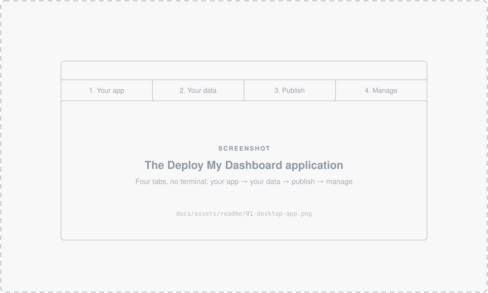
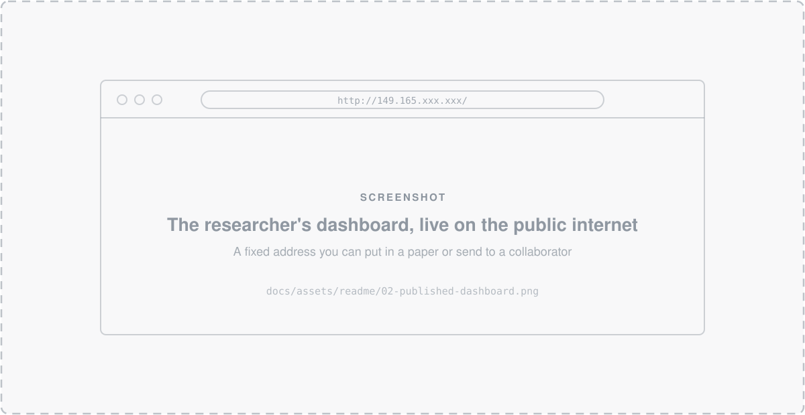
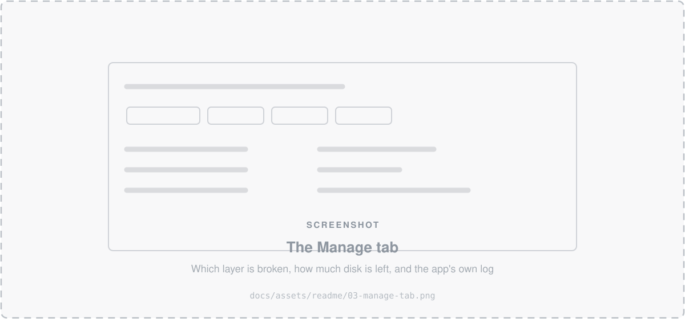

<div align="center">

# Jetstream2 Dashboard Deploy

### Get your research dashboard off your laptop and onto the open web — without learning Docker.

Point it at an **R Shiny**, **Plotly Dash**, **Python Shiny**, or **Streamlit** project.<br>
Get back a public URL that stays up.

[**📖 Read the guide**](https://jetstream2-dashboard-deploy.readthedocs.io/) · [Quick start](#quick-start-command-line) · [How it works](#how-it-works)

[](https://jetstream2-dashboard-deploy.readthedocs.io/)
[](LICENSE)


</div>

---

## The problem

You built a dashboard. It works on your laptop. Now a collaborator wants to see it, a reviewer wants a link, and a funder wants it to still work in three years.

Between you and that link sits a stack most researchers were never meant to learn: containers, reverse proxies, WSGI servers, TLS certificates, package pinning, and a Linux server you have to keep alive.

**This project removes that stack from your job description.**

<div align="center">
  
</div>

## What it does

Drop in a project. It reads your code to work out which of the four frameworks you're using, builds a self-contained image with the right dependencies, and serves it on port 80 behind a proper web server.

|  |  |
|---|---|
| 🔍 **Works out your framework from your code** | Not from filenames — `app.py` could be three different things. It reads the imports. |
| 📦 **Handles the dependency mess** | Generates a missing `renv.lock` for you. Detects geospatial R projects and switches to a GDAL-ready base image automatically. |
| 🗄️ **Keeps data out of the image** | Your dataset lives on a storage volume and is attached at run time — so updating it takes a restart, not a rebuild. |
| 🌐 **Production web server included** | nginx in front, with WebSockets, gzip, rate limiting, a real maintenance page, and TLS when you have a domain name. |
| ❤️ **Stays up** | Restarts on crash, and a watchdog catches the harder failure — alive but no longer answering. Survives reboots. |
| 🖥️ **No terminal required** | A desktop application walks researchers through it. It's a thin front end over the same scripts, so nothing is hidden. |

<div align="center">
  
</div>

## Who this is for

**Researchers** who have a working dashboard and need it online, permanently, without becoming a systems administrator. → **[Start with the guide.](https://jetstream2-dashboard-deploy.readthedocs.io/)**

**Research computing staff** supporting them, who want one repeatable path instead of a bespoke setup per project. → [Technical reference](docs/user-guide/reference/deployment.md)

Built for [Jetstream2](https://jetstream-cloud.org/), the NSF-funded research cloud — free to U.S. researchers through [ACCESS](https://access-ci.org/).

## How it works

Two scripts with one clean split between them. **`bootstrap.sh` provisions the host; `build_and_run.sh` provisions the app.**

```
                    ┌──────────────────────────────────────────────┐
   internet  ───→   │  nginx  :80/:443                             │
                    │    TLS · WebSockets · gzip · rate limiting   │
                    └───────────────────┬──────────────────────────┘
                                        │  127.0.0.1
                    ┌───────────────────▼──────────────────────────┐
                    │  your dashboard, in a container              │
                    │    Shiny Server │ gunicorn │ shiny │ streamlit│
                    └───────────────────┬──────────────────────────┘
                                        │
                    ┌───────────────────▼──────────────────────────┐
                    │  your data, mounted from a storage volume    │
                    └──────────────────────────────────────────────┘
```

Your code is baked into the image, so it's self-contained and versioned. Your data is not, so you can update it without rebuilding. A health check feeds a watchdog that restarts the container if it stops answering.

<div align="center">
  
</div>

## Quick start (command line)

For the click-through version, see **[the guide](https://jetstream2-dashboard-deploy.readthedocs.io/)** — it starts from creating the Jetstream2 instance.

```bash
git clone https://github.com/stephenconklin/Jetstream2_Dashboard_Deploy.git
cd Jetstream2_Dashboard_Deploy

# One-time: provision the host (Docker, nginx, swap, TLS, watchdog)
sudo ./deploy/bootstrap.sh

# Deploy any of the 4 frameworks — no config, no Dockerfile to pick
./deploy/build_and_run.sh /path/to/your/project
```

Visit `http://<instance-ip>/`.

```bash
# See what it would do, without building anything
./deploy/build_and_run.sh --dry-run /path/to/your/project

# When the page won't load: which layer is broken?
./deploy/manage.sh health
```

Try it against a bundled example first — one per framework, in [`examples/`](examples/):

```bash
./deploy/build_and_run.sh examples/streamlit-hello-world
```

> [!NOTE]
> `bootstrap.sh` is optional. Without it the container publishes port 80 directly. With it, nginx serves port 80 while the app binds loopback only — which is what makes TLS, rate limiting and a maintenance page possible.

> [!IMPORTANT]
> A successful deploy means your dashboard is **reachable**, not that it's **correct**. Shiny and Streamlit render their own errors as a page and still answer HTTP 200. Always open it once.

## Documentation

| | |
|---|---|
| 📖 **[User guide](https://jetstream2-dashboard-deploy.readthedocs.io/)** | Start here. Creating the instance and storage volume, preparing your project, publishing it, keeping it running. Assumes no Docker and no terminal. |
| 🔧 **[Deployment reference](docs/user-guide/reference/deployment.md)** | Every environment variable, health verdict, and design decision, with the reasoning. |
| 📤 **[Getting files onto the instance](docs/user-guide/reference/getting-your-files-onto-the-instance.md)** | Git, drag-and-drop, rsync, cloud storage, Globus. |
| ⌨️ **[Command line equivalents](docs/user-guide/reference/command-line.md)** | Every button in the application, and the command it runs. |

<details>
<summary><b>What's in this repository</b></summary>

```
deploy/
├── build_and_run.sh         # the one script: detect framework, build, run, smoke-test
├── bootstrap.sh             # root-only: provision the host (Docker, nginx, TLS, swap, autoheal)
├── manage.sh                # status / health / logs / restart / stop / disk / report
├── deploy.env.example       # template for bootstrap's host-specific settings
├── lint.sh                  # shellcheck + python syntax check
├── lib/
│   ├── common.sh            #   shared build/run/retry/smoke-test/data-dir logic
│   ├── detect_framework.sh  #   framework auto-detection
│   ├── proxy.sh             #   where the container binds, and how it's health-checked
│   ├── disk.sh              #   free space, and reclaiming it
│   └── persist_mount.sh     #   root-only: make a data volume survive reboot
├── nginx/                   # the reverse proxy config + maintenance page
├── docker/                  # one Dockerfile per framework, plus the R dependency scripts
├── gui/                     # the desktop application (Tkinter, stdlib only)
├── desktop/                 # launcher icon + researcher image build script
└── app/                     # drop-in slot for the project to deploy (gitignored)

examples/                    # one minimal self-test app per framework
docs/user-guide/             # the guide, published to Read the Docs
```

</details>

<details>
<summary><b>Managing a running dashboard</b></summary>

```bash
./deploy/manage.sh health     # which layer is broken — start here when the page won't load
./deploy/manage.sh status     # deployed / running / answering, plus the URL
./deploy/manage.sh logs 200   # the app's own log (stdout AND stderr)
./deploy/manage.sh restart    # restart without rebuilding
./deploy/manage.sh disk       # free space, and how much Docker can give back
./deploy/manage.sh cleanup    # give it back (safe: leaves your running image alone)
./deploy/manage.sh report     # one file to attach when asking for help
```

`health` is the one that matters. With nginx in front, an app failure and a proxy failure look identical from a browser but need completely different fixes — this says which you have.

The desktop application's **Manage** tab renders the same output, re-checks every 30 seconds, and has buttons for all of it. Full reference: [command reference](docs/user-guide/reference/deployment.md#command-reference).

</details>

<details>
<summary><b>Contributing and local development</b></summary>

```bash
./deploy/lint.sh                      # shellcheck over every tracked .sh, plus a Python syntax pass
git config core.hooksPath .githooks   # one-time: run it automatically before each commit
```

There's no CI and no test suite — verifying a change means running one of the bundled examples through `build_and_run.sh`. Note that R Shiny builds on Apple Silicon go through emulation, so they're slow but they do work.

Build the docs locally:

```bash
pip install -r docs/user-guide/requirements.txt
mkdocs serve        # http://127.0.0.1:8000
```

Design rationale for the repository itself lives in [`CLAUDE.md`](CLAUDE.md).

</details>

## License

MIT — see [LICENSE](LICENSE).

Built for researchers using [Jetstream2](https://jetstream-cloud.org/). The desktop application vendors the MIT-licensed [Azure ttk theme](https://github.com/rdbende/Azure-ttk-theme).
